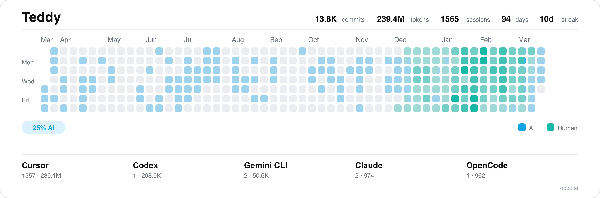

<div align="center">


# oobo

### Git for agents (and humans).

A transparent git decorator that enriches every commit with AI context:<br/>sessions, tokens, and code attribution — across 10 AI coding tools.<br/>No workflow changes. No plugins. No cloud required.

[](LICENSE-APACHE)
[](https://github.com/ooboai/oobo/actions/workflows/ci.yml)
[](https://github.com/ooboai/oobo/releases)
[](https://github.com/ooboai/oobo/issues)
[](https://github.com/ooboai/oobo)

[Documentation](https://docs.oobo.ai) · [Report Bug](https://github.com/ooboai/oobo/issues/new?labels=bug) · [Request Feature](https://github.com/ooboai/oobo/issues/new?labels=enhancement) · [Contributing](CONTRIBUTING.md)

</div>

---

## Installation

```bash
curl -fsSL https://oobo.ai/install.sh | bash
```

**Platforms:** macOS (Apple Silicon, Intel) · Linux (x86_64, ARM64, glibc, musl)

Or grab a binary from [Releases](https://github.com/ooboai/oobo/releases).

---

## Features

- **Drop-In Git Replacement** — Use `oobo` exactly like `git`. Every command passes through transparently. Read operations have zero overhead.
- **AI Session Tracking** — Automatically discovers and links AI chat sessions to your commits — which agent wrote what, how many tokens it took, and which conversation produced each change.
- **10 Tools Supported** — Cursor, Claude Code, Gemini CLI, OpenCode, Codex, Aider, GitHub Copilot, Windsurf, Zed, and Trae.
- **Code Attribution** — Know exactly which lines were AI-generated vs human-written, per commit.
- **Agent-Native** — Every command supports `--agent` (compact, pipe-delimited) and `--json` (structured) output modes. Built for agents that commit code constantly across tools.
- **Local-First, Private by Default** — Everything stays in `~/.oobo/`. Nothing leaves your machine unless you opt in. No telemetry. Secrets are redacted before sharing.
- **Anchor System** — Extends git commits with structured AI metadata that travels with the repo via a git orphan branch. No external dependencies.

---

## Quick Start

```bash
# 1. Install — setup runs automatically, detects your tools, configures everything
curl -fsSL https://oobo.ai/install.sh | bash

# 2. Use oobo wherever you'd use git — everything passes through
oobo commit -m "fix auth middleware"
oobo push origin main

# 3. See what happened
oobo anchors       # enriched commit history with AI context
oobo sessions      # browse your AI chat sessions
oobo stats         # token usage, attribution breakdown
```

**Optionally**, alias `git` so you don't have to think about it:

```bash
oobo alias install      # adds alias git=oobo to your shell rc
```

**Optionally**, connect to [oobo.ai](https://oobo.ai) for free cloud sync:

```bash
oobo auth login --key <your_key>
```

---

## How It Works

```
You run:  oobo commit -m "fix auth middleware"

  1. Execute real `git commit`
  2. Detect write operation
  3. Read AI sessions from local tool storage
  4. Build anchor: commit + sessions + tokens + attribution
  5. Write anchor to local DB + git orphan branch
  6. POST anchor to remote (if configured) → /anchors/ingest
  7. Return git's exit code unchanged
```

Read operations (`status`, `log`, `diff`, ...) pass straight through to git with zero overhead.

### The anchor

An **anchor** is oobo's core primitive — it extends a git commit with AI context:

```
Git:   commit = diff(files)
Oobo:  anchor = commit + sessions + tokens + attribution
```

Each anchor records which AI sessions contributed, token counts, code attribution (AI vs human lines), model used, and session duration. Anchors live in a local SQLite database and on a git orphan branch (`oobo/anchors/v1`) that travels with the repo.

---

## Supported Tools

| Tool                | Sessions | Transcripts | Token Stats | Agent Hooks |
| ------------------- | -------- | ----------- | ----------- | ----------- |
| Cursor              | ✓        | ✓           | ✓           | ✓           |
| Claude Code         | ✓        | ✓           | ✓           | ✓           |
| Gemini CLI          | ✓        | ✓           | ✓           | ✓           |
| OpenCode            | ✓        | ✓           | ✓           | ✓           |
| Codex CLI           | ✓        | ✓           | ✓           | —           |
| Aider               | ✓        | ✓           | ✓           | —           |
| GitHub Copilot Chat | ✓        | ✓           | ✓           | —           |
| Windsurf            | ✓        | ✓           | partial     | —           |
| Zed                 | ✓        | ✓           | ✓           | —           |
| Trae                | ✓        | ✓           | partial     | —           |

All tools are read-only — oobo never writes to AI tool data directories.

---

## For AI Agents

Oobo is built for agents. Agents commit code constantly, across tools, often in parallel. Without oobo, there is no record of which agent wrote what, how many tokens it took, or which conversation produced a given function.

### Agent install

```bash
curl -fsSL https://oobo.ai/install.sh | bash -s -- --agent
# → {"status":"ok","version":"...","binary":"...","platform":"..."}
```

The `--agent` flag suppresses colors and interactive prompts and returns a single JSON line.

### Output modes

Every command supports two structured output modes:

- **`--agent`** — compact, pipe-delimited text. Lists have a schema header (`# field | field | ...`) then one record per line. Designed for minimal token cost.
- **`--json`** — full structured JSON for scripts and programmatic use.

```bash
oobo sessions --agent          # compact session list
oobo sessions --json           # full JSON with all fields
oobo anchors --agent           # compact commit log
oobo stats --json              # full analytics as JSON
```

### Skill file

Oobo installs a skill file at `~/.oobo/skills/oobo/SKILL.md` during `oobo setup`, with symlinks in `~/.agents/skills/oobo/`, `~/.claude/skills/oobo/`, `~/.codex/skills/oobo/`, `~/.cursor/skills/oobo/`, and `~/.gemini/skills/oobo/`. AI coding tools discover the skill automatically and know how to install and use oobo.

### Agent lifecycle hooks

For tools that support it (Cursor, Claude Code, Gemini CLI, OpenCode), oobo installs hooks that track agent activity in real time: session start/end, tool calls, subagent spawns, thinking events, and context compaction. This enables precise session linking and rich telemetry attached to every commit anchor.

---

## Commands

### Browsing sessions

```bash
oobo sessions                    # interactive TUI — navigate with arrows
oobo sessions --all              # sessions across all projects
oobo sessions search "auth bug"  # search by keyword
oobo sessions list --tool claude -n 10
oobo sessions show abc12def      # view by ID prefix
oobo sessions export abc12def --format md --out chat.md
```

### Enriched commit history

```bash
oobo anchors                     # commit history with AI context
oobo anchors -n 20               # show last 20 commits
oobo a --agent                   # compact output (short alias)
```

### Code attribution

```bash
oobo blame src/main.rs           # per-line AI/human attribution at HEAD
oobo blame src/main.rs abc123    # at a specific commit
oobo blame src/main.rs --json    # structured JSON output
```

### Analytics

```bash
oobo stats                       # tokens, attribution, productivity
oobo stats --project myapp       # per-project
oobo stats --tool cursor         # per-tool
oobo stats --since 30d           # time-filtered
```

### Projects

```bash
oobo projects                    # interactive TUI for all tracked projects
oobo projects show myapp         # details + sessions for a project
```

### Developer card

```bash
oobo card                        # generate your developer stats card (PNG)
oobo card --format svg           # SVG output
oobo card --out dev.png          # save to a custom path
```

<div align="center">

</div>

### Sharing & exporting

```bash
oobo share <session_id>                # share a redacted session
oobo share <session_id> --out chat.md  # save as markdown
oobo sessions export <id> --format md  # export full session
```

### Sync & transparency

```bash
oobo sync                        # show current sync status
oobo sync on                     # enable backend sync
oobo sync off                    # disable backend sync
oobo transparency on             # sync redacted transcripts for this repo
oobo transparency off            # keep transcripts local only
```

### Auth

```bash
oobo auth login                  # log in to api.oobo.ai (free)
oobo auth login --key <key>      # authenticate with an API key
oobo auth status                 # show auth state
oobo auth set-remote <url>       # point to a self-hosted server
```

### PR / MR context

```bash
oobo pr                          # AI contribution summary for current branch
oobo pr --base origin/main       # explicit base ref
oobo pr --json                   # full JSON output
```

### Maintenance

```bash
oobo scan                        # discover projects + sessions
oobo index                       # compute token counts and analytics
oobo inspect --fix               # diagnose and auto-repair issues
oobo update                      # check for updates and self-update
```

---

## CI Integration

Automatically post AI contribution context on every pull request. When a team member opens a PR, oobo reads the anchor metadata for those commits and drops a comment showing AI%, tools used, tokens consumed, and per-file attribution.

### GitHub Actions

```yaml
# .github/workflows/oobo.yml
name: AI Context
on: [pull_request]
jobs:
  oobo:
    runs-on: ubuntu-latest
    permissions:
      pull-requests: write
    steps:
      - uses: actions/checkout@v4
        with:
          fetch-depth: 0
      - uses: ooboai/oobo@v1
```

### GitLab CI

```yaml
# .gitlab-ci.yml
include:
  - remote: 'https://raw.githubusercontent.com/ooboai/oobo/main/ci/gitlab/.oobo-ci.yml'
```

Requires a `GITLAB_TOKEN` CI/CD variable with `api` scope.

### Travis CI, CircleCI, Buildkite, Jenkins

Use the generic CI script — it auto-detects the platform and posts the comment:

```yaml
# Travis CI
after_success:
  - curl -fsSL https://raw.githubusercontent.com/ooboai/oobo/main/ci/oobo-ci.sh | bash

# CircleCI
steps:
  - checkout
  - run: curl -fsSL https://raw.githubusercontent.com/ooboai/oobo/main/ci/oobo-ci.sh | bash
```

Set `GITHUB_TOKEN` or `GITLAB_TOKEN` as a CI environment variable for the comment to be posted.

---

## Configuration

`oobo setup` runs an interactive wizard. Or edit `~/.oobo/config.toml` directly:

```toml
[server]
url = "https://api.oobo.ai"   # default — or your own server
api_key = "sk_..."

[transparency]
mode = "off"           # off | on
```

Toggle tools individually:

```toml
[cursor]
enabled = true

[claude]
enabled = false
```

Full list: `cursor`, `claude`, `gemini`, `windsurf`, `aider`, `copilot`, `zed`, `trae`, `codex`, `opencode`.

---

## Remote & Self-Hosting

By default, oobo points at **`api.oobo.ai`** — our free hosted backend. Create a free account at [oobo.ai](https://oobo.ai), grab an API key, and run:

```bash
oobo auth login --key <your_key>
```

To run your own server:

```bash
oobo auth set-remote https://oobo.mycompany.com
```

Your backend implements endpoints under `/anchors`. Only **ingest** is required:

| Endpoint           | Method | Auth            | Required | Purpose                          |
| ------------------ | ------ | --------------- | -------- | -------------------------------- |
| `/anchors/ingest`  | POST   | Bearer token    | **Yes**  | Accept anchor data from commits  |
| `/anchors/verify`  | GET    | Bearer token    | No       | Verify an API key is valid       |
| `/anchors/health`  | GET    | None            | No       | Health check (connectivity test) |
| `/anchors/share`   | POST   | Bearer optional | No       | Accept shared sessions           |

See `src/remote/payload.rs` for the full anchor payload schema.

---

## Build from Source

```bash
git clone https://github.com/ooboai/oobo.git && cd oobo
cargo build --release
# binary at target/release/oobo
```

---

## Privacy

- **Read-only** — never writes to AI tool directories
- **Local by default** — everything stays in `~/.oobo/`. Nothing leaves your machine unless you configure a remote
- **Secret redaction** — sessions are scrubbed with [gitleaks](https://github.com/gitleaks/gitleaks) patterns before sharing
- **No telemetry** — oobo does not phone home
- **Config protection** — API keys in config get `chmod 0600`

See [SECURITY.md](SECURITY.md) for the full policy.

---

## Contributing

Oobo is open source under [Apache 2.0](LICENSE-APACHE) and [MIT](LICENSE-MIT) (dual licensed, at your option). See [CONTRIBUTING.md](CONTRIBUTING.md) for development setup, project structure, and guidelines.

---

## License

Dual licensed under [Apache 2.0](LICENSE-APACHE) and [MIT](LICENSE-MIT), at your option.
